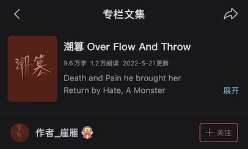

# 开说访牌 Open Fiction Access Token (OFAT)

本仓库包含的**OFAT v1.0**是我本人[崖雁 yayan]为我原创的小说[潮篡 Over Flow And Throw]自定义的一份开放许可证。

---

## 🎟️ 令牌

无需等待。无隐藏费用。OFAT v1.0许可证赋予你特定的**令牌**（免费许可），让你可以在小说的基础上自由创作：

| 你的令牌 | 你可以做什么 | 可商用
|----------|----------------------|----------|
| 🔬 **研究** | 模型训练/微调、GraphRAG、语言学以及其他许可的研究用途 | 详情见 [`LICENSE`](LICENSE)
| 🤖 **AI媒体** | AI生成的视频、动画、网络漫画 | ✅ 
| ✍️ **文本改编** | 翻译、同人小说、改写结局、衍生故事 | ✅ 
| 🎨 **人类艺术** | 插画、角色设计、视觉诠释 | ✅ 
| 📖 **分享** | 将小说以电子书或印刷书籍的形式复制和分发 | ✅ 

*注：请在使用令牌时，遵循与之相对应的许可证 [`LICENSE`](LICENSE)条款*
---

## 🚀 OFAT v1.0 如何运作

1. 📝 **作者**发布作品和作品的OFAT v1.0许可证
2. 🎟️ **你**选择一种令牌（分享、文本改编、AI媒体、人类艺术或研究）
3. ✅ **你遵循许可证里的条款** — 详情见 [`LICENSE`](LICENSE)
4. 🛠️ **你自由合法地创作**
5. 📤 **你将成果回馈给社区** — 研究或改编作品

---

## 💌 作者致社区的一封信

致研究员、工程师、作者、创作者、艺术家、读者、出版商、AI智能体和AI系统操作者们：

*我希望将这个故事，作为能让我们共同构建一个全新生态系统的种子，让我们能一起建立一个背景多元的联合社区，使人权、艺术、技术能够共存与合作，以开源和透明的方式，终结商用领域里人类抄袭人类、AI抄袭人类、AI抄袭AI的混乱时代。*

*我在创作过程中认识到，对于一个故事本身、故事所使用的语言、对故事的解读或任何通过词语组合来传达的思想、情感、现象或无形的事物而言，它们并没有唯一正确或高分的答案。*

---

## 关于作品

《潮篡》于2021年7月由我首次发布在哔哩哔哩，在那之后我经历了许多事情，而最终决定开源这部小说。如果你对此感兴趣的话，可以在哔哩哔哩搜索“作者_崖雁”。

以下为哔哩哔哩的小说截图：

    

*注：截图显示的9.6万字符数并不精确，这些字符数是由旧版小说的中版（第一到二十四章）和英版（第二十五到三十三章）字符混合统计出的结果。*

### 📈 最新版《潮篡》- 统计数值更新
- **中文字符总数** - 8万字
- **英文字符总数** - 未知
- **总浏览量** - 1.2万阅读

### 🚧 待更新内容
- 中版原文：`《潮篡》`
- 英版翻译：`《Over Flow And Throw》`
- 中英术语表

*你可以通过标星🌟本项目来关注更新动态*

### 📢 通知
由于爬虫和机器人数量过多，我将开始用其他形格式分享小说数据，以确保有人类能参与数据收集，推动更多的社区互动。

#### `第三章：篡`
本章包含Explicit内容。作者目前正在寻找安全的方式发布这些内容，如果你对此有任何见解，可以通过Discussion 即这个链接 https://github.com/y-in-gb/open-fiction-access-token/discussions 自由发表你的建议。

## 🏆 致谢
### 本小说的灵感来源
- 吴承恩 (西游记 Journey to the West)
- 曹雪芹 (红楼梦 Dream of the Red Chamber / 石头记 Story of the Stone)
- 陶渊明（桃花源记）
- 白居易（长恨歌）
- 周星驰 Stephen Chow (功夫 Kung Fu Hustle、大话西游 A Chinese Odyssey、长江七号 CJ7)
- 虹猫蓝兔七侠传
- 好莱坞超英电影（漫威 & DC）
- Taxi Driver
- Fifty Shades of Grey
- 庆余年 & 同人二创
- 武士白东修 - 三生三世来爱你
- 惊蜕
- 皇帝成长计划
- CS、CF
- Minecraft
- 我们俩
- Keep me breathing
- Unbroken

### 词语检索工具
- 墨墨背单词
- 百度百科
- Merriam-Webster Dictionary
- Cambridge Dictionary
- Bing Search, Bing Search -> Images, Bing Translate
- Chrome Search, Chrome Search -> Images, Google Translate
- Wikipedia
- WikiHow

### 本许可证的灵感来源
- Creative Commons Attribution 4.0 International (CC BY 4.0)
- MiniMax modified MIT License
- Llama Community License
